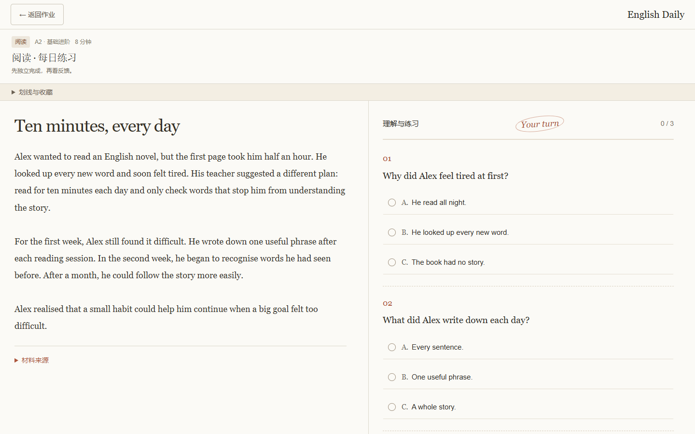
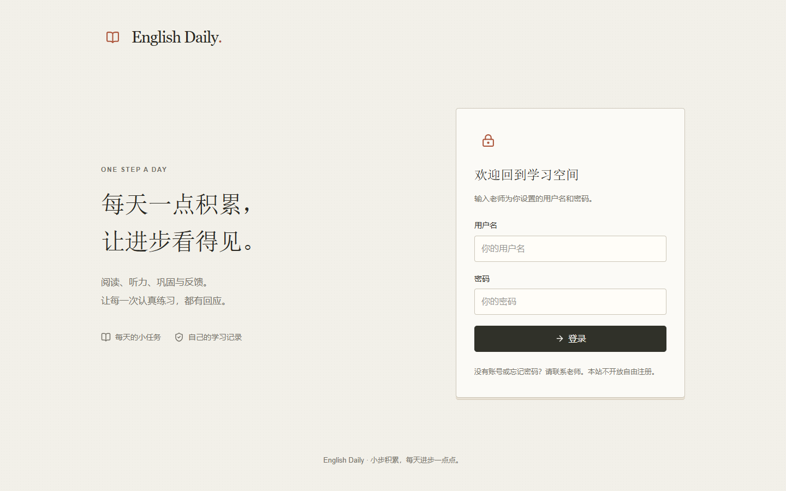
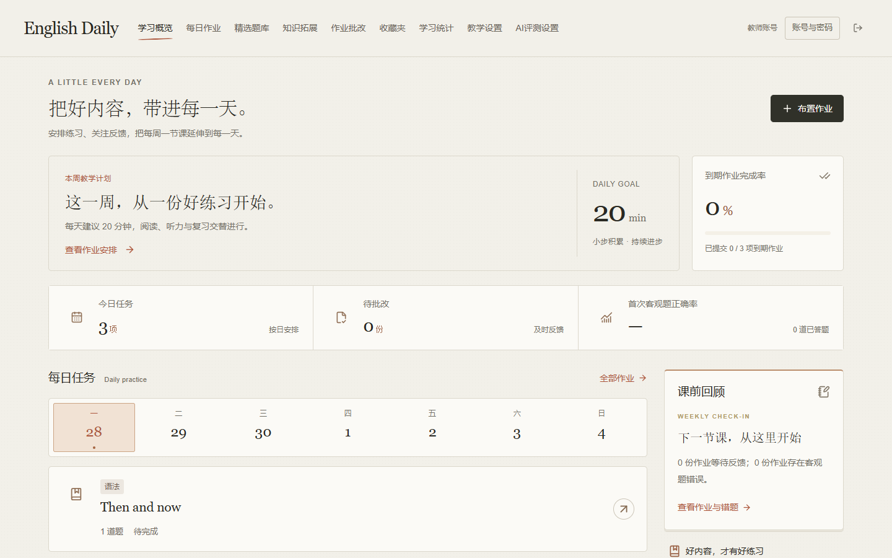
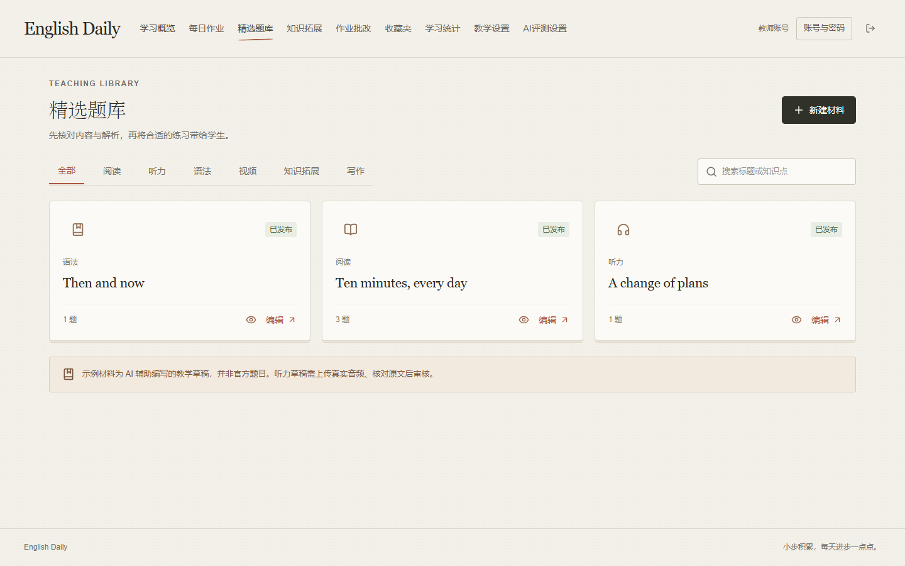
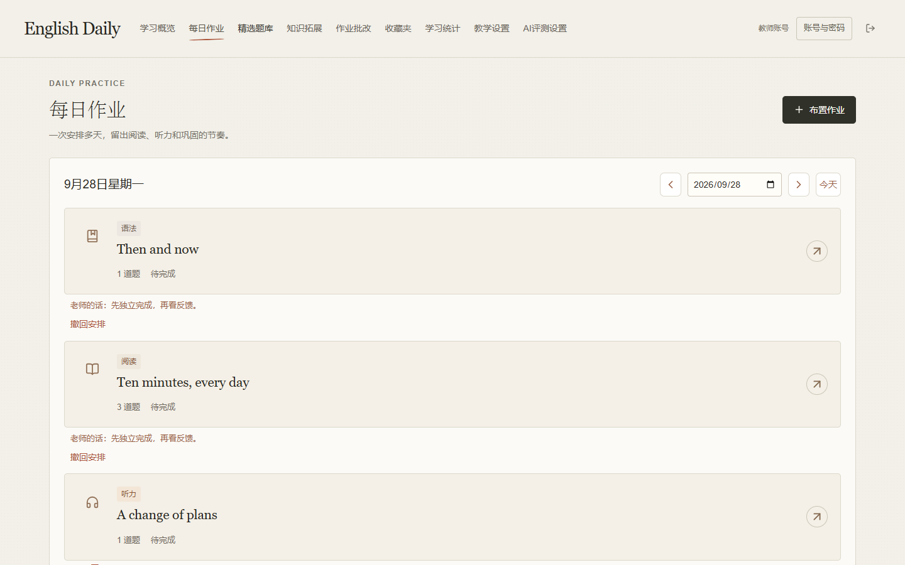
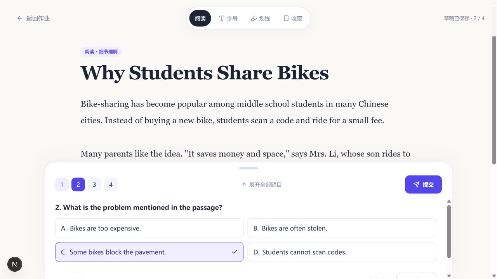
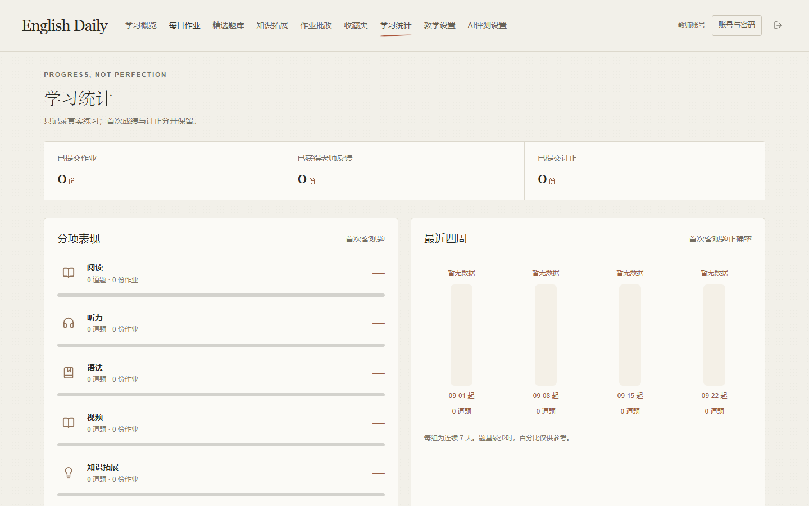

# English Daily 项目说明书与题型使用指南

> 一对一初三英语教学的每日练习空间。教师准备材料、布置任务并给出反馈；学生在同一网站完成练习、查看反馈和订正，学习记录持续保留。

**适合谁：** 希望把课堂之外的阅读、听力、语法与写作练习串成日常学习流程的教师和学生。当前产品按单教师、单学生场景设计。

**一句话理解：** 这是一套自托管的“备课—布置—作答—批改—订正—回顾”闭环工具，不只是静态题库。

## 核心功能

| 教师端 | 学生端 |
| --- | --- |
| 管理教学设置、学生账号与密码 | 使用自己的账号查看今日、待订正和历史作业 |
| 创建、导入、审核阅读/听力/语法/写作/视频材料与知识拓展 | 在独立练习页阅读材料、听音频并完成题目 |
| 选择已发布材料，按日期布置每日作业 | 草稿自动保存；提交后按开放规则查看答案与解析 |
| 查看提交、批改表达题、写反馈、要求订正 | 查看老师反馈并提交订正，首次成绩单独保留 |
| 查看学习统计和知识点表现 | 收藏单词、句子与批注，按需打印复习 |

**当前听力主线是转述训练。** 教师选择听力材料时，编辑器默认进入三阶段转述配置：听懂并记要点、看要点组织表达、听后独立转述。学生提交文本后由教师配置的 AI 服务评测。

## 先理解两种材料逻辑

| 材料 | 学生如何完成 | 系统如何记录 |
| --- | --- | --- |
| 阅读 | 看正文，回答选择、填空或表达题 | 选择/填空自动核对；表达题由老师评分 |
| 听力转述（当前主流程） | 听音或看给定关键词，用文本输入关键词/转述 | 调用教师配置的 AI 接口生成分数与建议 |
| 写作 | 看题目，在长文本框作答 | 老师按设置的满分评分、写反馈 |
| 当前新建语法、视频、普通知识拓展 | 阅读内容或观看视频后提交完成 | 记录完成，不进行逐题自动判分 |
| Culture Lab | 依次完成导入、学习、检测、表达 | 检测题全答且正确率达到 80%，并提交表达后标记完成 |

> **作业快照：** 已布置的作业使用布置时保存的材料内容；修改题库只影响之后布置的新作业。

## 阅读题：正文、题目、答案分开准备

1. 教师在“精选题库 → 新建材料”选择**阅读**，填写标题和阅读正文。
2. 在“题目”页逐题添加选择、填空或表达题，也可以导入 `<questions>` 包裹的 JSON 数组。每题有唯一编号、题干和知识点标签；选择题至少两个不同选项。
3. 在“答案与解析”页逐题填写标准答案和解析，也可以用 `<solutions>` JSON 按题号批量补充。选择题的正确答案必须与某个选项内容一致；导入时 `A`、`B` 等字母可转换为对应选项。
4. 在“发布”页检查正文、题目、答案，并决定**提交后**还是**老师批改后**开放答案与解析。通过核对后才能作为已发布材料布置。
5. 学生在练习页左侧看正文、右侧答题。手机上使用“文章 / 材料”和“题目 / 作答”切换。全部题目有答案后才可提交。

**判题例子：** 选择题保存的答案是选项文本，例如 `It saves money and space.`，学生选中相同选项即算正确。普通填空默认忽略首尾空格、字母大小写、连续空格和末尾标点；答案中用 `|` 分隔可接受的多个写法。表达题只展示参考答案，最终由教师评分。

## 听力：三阶段转述学习流程

目标是把听到的内容用自己的英语重新表达，允许简单句和同义表达。当前通过文字练习内容组织，不评价发音，也不等同于完整口语考试。

教师新建听力材料时，填写听力原文、每行一项的“信息名称: 标准信息”、参考转述。阶段一、三需上传音频；阶段二需提供学生可见的关键词。发布前配置 AI 接口。

| 阶段 | 学习目标 | 学生提交 |
| --- | --- | --- |
| 一：听懂并记要点 | 找出关键事实 | 分类关键词笔记；可标记不确定、没听到 |
| 二：看要点组织表达 | 把零散信息连成清楚的表达 | 根据教师给定要点完成英文转述 |
| 三：听后独立转述 | 独立完成听、记和组织 | 分开保存的听力笔记和英文转述 |

学生页面明确展示任务步骤。学习练习提供表达示例，提交前有自查清单；不要求学生背诵参考答案。阶段一只展示信息获取评分。

**播放方式：** 新材料默认学习练习，可重听并调整速度和进度；限次练习按教师设置限制开始播放的次数，暂停后继续不重复计数。旧材料保留原有限制。当前没有按信息点切分音频的自动定位功能，可在学习练习中手动调整进度。

**反馈与订正：** AI 返回信息点核对、学生表达、材料依据，以及本次最值得修改的两条建议。教师可以选择遗漏或错误信息需要订正，或者由老师决定。学生订正后会再次评测，首次成绩保留，最新订正表现单独显示；订正练习不作为新的独立测试成绩。教师可以查看首次与订正笔记并人工确认完成。

**评测失败：** 答案仍保留，页面显示失败提示并允许重新评测；也可等待老师批改，不生成虚假分数。

**答案开放：** 提交前仅向学生返回信息项名称，不返回标准信息、原文和参考转述。提交后遵循原有开放设置，原文和参考转述折叠在反馈之后，鼓励先根据提示自行修改。

**兼容性：** 既有作业快照和首次成绩保留；旧的单文本笔记仍可查看与订正。旧重点句听写继续使用原流程。无需新增数据库迁移。

## 语法、写作、视频与知识拓展

### 语法

当前新建语法材料由教师在一个内容区粘贴讲解、题目和答案，学生看到的内容与教师填写的基本一致。学生阅读后提交完成记录；系统不会从这段文本中提取答案，也不会按空格或选择项自动判分。因此，若希望学生逐题作答并自动核对，可使用**阅读**材料创建结构化选择/填空题。

### 写作

当前新建写作材料是一道表达题。教师填写写作题目和 **1–100 的整数满分**；学生在长文本框写作，全部输入后提交。老师在“作业批改”中评分，并可针对内容、语言和结构写反馈。表达题不会自动判分；是否要求学生订正由老师明确勾选，未得满分不自动等于必须订正。订正重新进入待批改，首次作答和成绩不被覆盖。

### 视频与普通知识拓展

视频材料上传 MP4/WebM（80MB 内）并可附说明；普通知识拓展使用 HTML 内容，脚本、表单与危险链接会被过滤。两类材料当前都以学习/观看后的**完成记录**为主，不自动逐题评分。学生在“知识拓展”中也可直接查看已发布的 HTML 内容。

### Culture Lab

文化主题在普通 HTML 之外加入五步路径：Explore 导入背景，Learn 阅读正文与词汇/文化卡片，Check 完成选择题，Express 用英语表达，Complete 查看完成状态。教师至少准备三道检测题。学生必须答完全部检测题且正确率达到 **80%**，再提交非空表达，才会标记主题完成；进度会保存。

## 共同的作答、评分与反馈规则

- **草稿：** 学生输入后约 0.9 秒自动保存到服务器；浏览器还会缓存尚未同步的输入，重进任务时可选择恢复。老师试做只预览，不写入学生成绩。
- **提交：** 结构化题目必须全部作答才能提交；已提交的首次答案不会再被直接改写。当前语法、视频、普通知识拓展没有独立题目，提交代表完成学习。
- **分数：** 阅读选择/填空按正确题数记录首次 `得分 / 总题数`；写作由教师评分；听力转述评测成功时记录 AI 给出的 0–100 分。
- **答案开放：** 阅读可由老师设置提交后或批改后开放答案与解析。转述作答期间不展示听力原文或参考转述，提交后的内容展示遵循材料开放设置；未开放的答案不进入学生错题统计。
- **老师批改：** 教师查看首次答案，给表达题评分、写反馈，并决定是否要求表达题订正。学生端可标记“我已看过反馈”；老师更新反馈后会重新提醒。
- **订正：** 客观题订正自动核对；含表达题的订正重新进入待批改。首次答案与首次客观题成绩继续保留。
- **作业快照：** 布置时保存材料副本。修改题库只影响之后布置的新作业。

## 页面概况

以下图片来自当前项目在**隔离演示数据**下运行的界面。演示姓名和题目仅用于说明，未使用现有教学记录。

### 1. 登录页

教师与学生从同一网址登录，系统根据账号权限显示不同工作区。网站不开放自由注册。

### 2. 教师学习概览

首页集中展示近期任务、到期作业完成率和待处理反馈，教师可以直接进入布置作业流程。

### 3. 精选题库与每日作业

教师核对材料所需内容后发布：阅读检查题目与解析，听力转述检查音频、原文、信息槽和参考转述。发布后可选日期安排作业。题库后续编辑不会改动已经布置的作业快照。

### 4. 学生作业与练习页

学生端按“今天、待订正、历史”组织作业。阅读练习页以正文为中心，顶部提供字号、划线和收藏，底部题目抽屉支持逐题作答或展开全部题目。听力转述页按记录要点、写转述、检查提交组织，播放与提交按钮显著显示；手机端同样保留底部操作区。

### 5. 学习统计

教师可查看提交数量、反馈与订正数量、各题型首次客观题表现、近四周趋势和需要再练的知识点。演示图没有提交记录，因此数值为零。

## AI 配置中心

教师统一设置连接地址、模型、密钥、通用教学要求，以及三个听力阶段、阅读出题、写作批改各自的提示词、模型与启停状态。保存后使用“测试当前场景”验证连接。阅读出题先生成待核对草稿；作文建议采用后仍需教师保存批改。暂停听力评测不会丢失学生答案，恢复启用后可重新评测。真实反馈质量仍需结合学生水平与所选模型核对。

## 一次完整的使用流程

1. **教师备课：** 新建或导入材料，核对题目、答案、来源和媒体文件，通过审核并发布。
2. **布置练习：** 在“每日作业”选择日期和已发布材料，可附给学生的话。
3. **学生完成：** 学生在“我的作业”进入独立练习页，作答过程中保存草稿，完成后提交。
4. **形成反馈：** 阅读客观题自动核对；听力转述由配置的 AI 服务评测；写作由教师评分并填写建议。
5. **学生订正：** 学生查看反馈、提交订正；首次答案与首次成绩继续保留。
6. **回顾积累：** 双方通过学习统计识别薄弱点，学生还可用收藏夹整理和打印单词、句子。

## 部署与使用边界

项目使用 Next.js、Node.js、SQLite 和服务器本地媒体文件，支持 Docker Compose 部署到自有服务器。账号、作业和媒体存放在服务器持久化数据目录；访问公网网站时应配置 HTTPS。详细初始化、备份、恢复和升级步骤见仓库根目录 [README](../../README.md)。

当前设计重点是**单教师与单学生**的一对一教学。AI 转述能力取决于教师配置的外部评测服务；音频、视频和文化主题内容需要教师自行准备、审核与发布。

## 知识拓展全屏学习与夜间阅读

知识拓展现在使用独立页面，列表支持分类和关键词搜索，显示主题简介、难度与预计时长。教师题库预览同样打开独立页面。顶部“返回知识拓展”回到主题库。

内容可采用纯 HTML 自学页，也可启用 Culture Lab 五步流程，保存理解检测与英语表达。首批课程规划和 California/LA 示例见 [主题课程设计](../knowledge-topics/主题课程设计.md)。

全站右下角提供月亮/太阳切换按钮。默认跟随系统，手动选择保存在浏览器。HTML 阅读页同步使用夜间文字与背景，图片保持原色。
